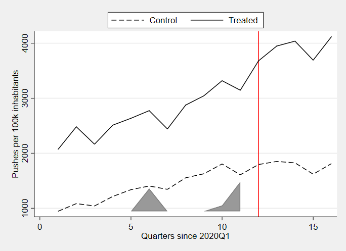
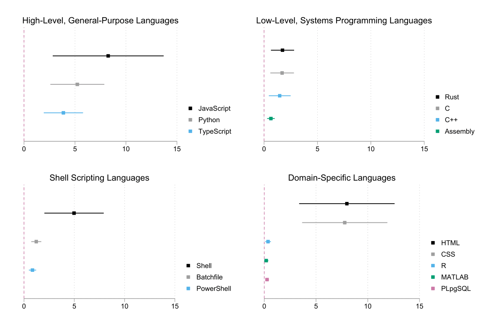

# Impact of the Availability of Chat-GPT on Software Development Activity

In recent years, advancements in artificial intelligence have revolutionized various fields, with software development being one of the most impacted. The rise of large language models (LLMs), particularly OpenAI's ChatGPT, has brought about a significant shift in how developers approach coding, debugging, and software architecture. The current state of AI development is marked by rapid progress and widespread adoption, driving productivity and efficiency in unprecedented ways.

Artificial intelligence, especially in the realm of natural language processing, has evolved at an exponential rate. The sheer volume of AI patents has grown eight times faster than all other patents combined according to the World Intellectual Property Organization's 2022 report, underscoring the immense interest and potential of this technology. ChatGPT, one of the most advanced models developed by OpenAI, exemplifies the leap from basic automation to sophisticated, context-aware assistance capable of generating human-like text.

One of the most compelling use cases for ChatGPT is in software development. Traditionally, coding has been a meticulous and time-consuming process, often requiring extensive trial and error. However, with ChatGPT, developers can now generate code snippets, debug errors, and even receive architectural suggestions in real-time. This technological advancement enhances labor efficiency, allowing developers to focus on higher-level problem-solving and innovation.

Our research analyzes the impact of ChatGPT on the velocity of software development. Our main metric is the number of git pushes per 100,000 inhabitants of each country. We also analyze the number of repositories and the number of unique developers per 100,000 people. Finally, we explore the impact in a variety of programming languages. We mainly focus on comparative methods for panel data in observational studies, with the goal of estimating the average treatment effect. Our main method uses synthetic difference in differences (SDiD), as described by Arkhangelsky, Athey, Imbens and Wager (2021). We also describe the results for difference in differences (DiD) and synthetic control (SC) methods.

### Data

Our data was provided by the [GitHub Innovation Graph](https://github.com/github/innovationgraph) initiative. For the three metrics, we remain with data for 147 countries from Q1 of 2020 to Q4 of 2023. Our control group is the subset of 27 countries for whom ChatGPT was not available at launch, and the remaining 120 are considered treated; in the time span described, there have been no changes either group's composition. We also consider the start of the treatment to be Q4 of 2020, when the deployment of ChatGPT was announced.

### Main Results:

For our main measure, the number of Git Pushes per 100,000 people, our main method finds a significant increase of 645.6 pushes, from a pre-treatment baseline mean outcome of 1547.4. The other methods also find a positive effect, although with lower precision. The number of repositories created and the number of unique developers per 100,000 inhabitants also show a positive effect, though it is also, for the most part, insignificant across methods, and the significant cases may be explained by bias introduced by the difference in pre-treatment trends for each group.

These results would imply that, although the impact of ChatGPT does not lie in the increase of developers or projects, but in an acceleration of the pre-established development process. This acceleration is different depending on the language that is being used to develop, likely because of the difference in available training material for the GPT familly of models. We would expect high-level, general purpose languages to show a larger increase, as they are more popular and therefor perform better. For low-level or domain specific languages, we expect a smaller impact. This bears out in the analysis; in this case, we analyze the number of developers per 100,000 inhabitants who have made at least one push in a given language in each quarter. For example, we find that JavaScript had the largest increase in treated countries compared to control countries, of all languages we have analyzed: 8.3 more developers per 100,000 inhabitants pushing to repositories in this language. As for low-level languages analyzed, Rust saw the largest comparative increase with an estimate of 1.7. This is an interesting result as Rust is a relatively new language, so the amount of LLM training content might be small compared to a better stablished low-level language like C. However, Rust's rapid adoption overall may serve as an incentive for developers to learn and develop in this language over others. Finally, we see HTML and CSS as the ones with largest comparative increases among domain-specific languages (8 and 7.8, respectivelly). This is to be expected as they are commonly used together and they are largely popular for web development.

### Discussion:

ChatGPT shows promise for software development spaces, as it assists in the development in ways that lead to a larger output in the same amount of time. Some countries have legally allowed the availability of ChatGPT, while some others have prohibited it, leading to a differencial treatment assignment. We exploit this natural experiment to find the average effect of ChatGPT in countries where it is formally available. Our main method finds a large and significant increase in the output of source code in the countries where it is available, compared to those where it is not. This implies that economies may benefit from wider access to AI tools, as it can foster growth in software development and, therefor, overall economic growth.

We identify two possible caveats to our findings. First, the code outputed by the GPT familly of models may be of low quality or not suitable to the specifics of a developer's tasks, and while it may accelerate the development process, it might lower the quality of the code written, which could lead to code churn. Some exploratory analyses on the quality of machine-generated code have been made (e.g. GitClear, 2023), but they do not hold much inferential power. However, even assuming a relatively large amount of churn coming from machine-generated code, it would still lead to gains on the margin. Another weakness of our analysis is related to the extra-legal access to ChatGPT in countries where it is not legally available. If this type of access is large enough, it can lead to an underestimation of the average treatment effect.

Overall, we see these results as encouraging, as it gives evidence for labor-enhancing effects resulting from AI.